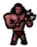
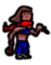

# hs-sync.github.io
A small dungeon Crawler brought to the web from the tabletop. Create with vanilla Javascript and HTML.

This little game was design to be a virtual version of our tabletop pocket RPG of the same name.
Feel free to download the free rulebook here: https://www.tabledropzone.com/downloads/tdz-house-rules

Enjoy the little game and join us on our YouTube channel https://www.youtube.com/@tabledropzone, where we discuss this game and so much more!

Welcome to Lungeon
==================

The tiny dungeon crawler for the small appetite
-----------------------------------------------

This little game was design to be a virtual version of our tabletop pocket RPG of the same name. Feel free to download the free rulebook here: [https://www.tabledropzone.com/downloads/tdz-house-rules](https://www.tabledropzone.com/downloads/tdz-house-rules)  
In this guide we will show you the very basics of how the game is played. everthing else, you need to figure out by yourself. watch the log window for hints and easter eggs. there is a lot to discover in the tiny world of these tiny dungeons.  

Gettig started
--------------

To enter a dungeon click start and then choose a class. each class has different attributes:  
  

|     |     |     |     |
| --- | --- | --- | --- |
|    **Sir Diamondheart** |    **Gronk** |    **Silk** |    **Magus the Grandwizard of Overhelm Son of the grand mage of Undertuxton bearer of the veil, watcher of the void** |
| Paladin | Barbarian | Thief | Wizard |
| This is the default class. | Gronk has axe Uahahaha. | She finds treasure where nobody else would look. | He can do magic better. |
| Life: 3   Mana: 1 | Life: 4   Mana: 0 | Life: 2   Mana: 1 | Life: 2   Mana: 2 |

  

Controls
--------

Once you have chosen your class, it is off to the adventure.  
Move around using the red arrow buttons (e.g. ) and click  for attacking,  for casting a spell (instant kill - if you have the spell and mana) and  to open treasure chests.

Battle
------

You will battle monsters in 3 categories:  

|     |     |
| --- | --- |
|  | Slime: wipe it away with a tissue |
|  | Hulk: They only want to cuddle... I'm fairly certain |
|  | Dragon: This will leave a mark |

  
Every encounter locks the player into battle until it is initially resolved. If the player gets hurt, he can chose to avoid the monster for now and chose a different path. However, for leveling up the player will need to slay monsters

Levelup
-------

Prog stand for progress and gets a bar every time a monster is slain. Once 3 monsters are slayn the plaer gains one level. This makes fights easier

Treasure
--------

You will com across tresure chests. here and there and everywhere. Open them using "OPN" and be surprised what you can find.  
... and no Gronk, you cannot eat them!  
(the exact information is in the rulebook).
